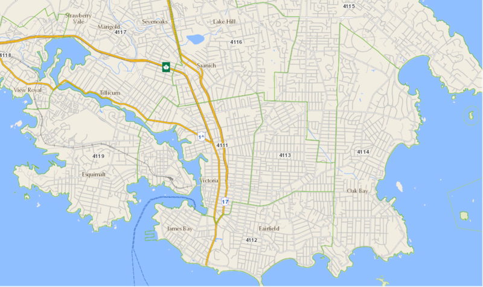

# areaservice
Community Health Service Area (chsa) locator service

The backend application uses Spring Boot with gradle, and handles GET requests/responses to/from an [external REST API](#the-open-maps-api) and is designed to feed a single page application (SPA) frontend that has yet to be built. The latitude/longitude parameters sent to the Open Maps API can be used as frontend input fields. The backend will only run if the MySQL instance is also up and running. The application structure includes Rest controller, service, model, data entity and data repository. 
    
The MySQL database is running in a MySQL docker container, including three tables: `request`, `response` and `chsa` (store the area code and area name). All the requests to the sample API should be stored in the `request` table. The `response` table has a foreign key `response.requestid` which should be linked to its `request.id`, and it should store `response.chsaid` from the `chsa.sysid` table. The remaining development is to parse the response and store data in `response` and `chsa` tables. The next step can implement and maintain a cached data repository of chsa table, for fast and flowless service.

1. MySQL database
   ## create mySQL podman/docker container
   `podman run --name mysql-server -p 3306:3306 -v /Users/<YOUR_USER>/data:/var/lib/mysql -e MYSQL_ROOT_PASSWORD=Password -d mysql`
    **OR**
   `docker run --name mysql-server -p 3306:3306 -v /Users/<YOUR_USER>/data:/var/lib/mysql -e MYSQL_ROOT_PASSWORD=Password -d mysql`


   ## connect as sql client
    `podman exec -it mysql-server mysql -u root -p`
    (input Password)
    **OR**
    `docker exec -it mysql-server mysql -u root -p`

   ## create database (inside running container)
    `CREATE DATABASE healthservice;`

   ## switch to healthservice database
    `USE healthservice;` 

   ## create tables inside DATABASE healthservice

   1) request table
      ```
      CREATE TABLE request (
      id bigint unsigned PRIMARY KEY NOT NULL AUTO_INCREMENT,
      featureid varchar(100) NOT NULL,
      coordinate varchar(23),
      requesttime timestamp );
      ```

   2) reponse table
      ```
      CREATE TABLE response (
      responseid bigint unsigned PRIMARY KEY NOT NULL AUTO_INCREMENT,
      requestid bigint unsigned NOT NULL,
      timestamp datetime,
      chsaid int,
      crs varchar(100) );
      ```

   3) chsa table
      ```
      CREATE TABLE chsa (
      sysid int PRIMARY KEY NOT NULL,
      areacode varchar(4) NOT NULL,
      areaname varchar(100) NOT NULL,
      ojectid int );
      ```

   Verify that tables have been created: 
   `show tables;`

   Exit out of mysql:
   `exit;` 

   Test that the container is running: 
   `podman ps`
   **OR**
   `docker ps`

2. Backend Application start

   ## Requirements
   - gradle v6.x (this app is not compatible with gradle v7.x)
   - java v11.x

   `cd areaservice`
   `./gradlew bootRun`

   you can test it by visiting `http://localhost:8090/area/-123.3646335+48.4251378` in your browser.

## The Open Maps API

The rollout of COVID-19 vaccinations required that people either know or can find their Health Authority Area based on where they live and work. This web service needs to consider the connection between where someone lives (in B.C.) and the corresponding Community Health Service Area (CMNTY_HLTH_SERV_AREA_NAME). In the map below, Community Health Service Areas are indicated by their codes (4111, 4112, 4113, etc.). The green boundaries on this map, with corresponding CHSA number codes (CMNTY_HLTH_SERV_AREA_CODE) at their centers, depict some sample boundaries of CHSAs near Victoria, BC. 



The following Open Maps API request takes latitude (+48.4251378) and longitude (-123.3646335) values as a specific point in Victoria and returns the name of the Community Health Service Area and the Community Health Service Area Code:

CMNTY_HLTH_SERV_AREA_NAME: “Downtown Victoria/Vic West” 
CMNTY_HLTH_SERV_AREA_CODE: “4111”

Example Open Maps API request: 
https://openmaps.gov.bc.ca/geo/pub/ows?service=WFS&version=1.0.0&request=GetFeature&typeName=pub%3AWHSE_ADMIN_BOUNDARIES.BCHA_CMNTY_HEALTH_SERV_AREA_SP&srsname=EPSG%3A4326&cql_filter=INTERSECTS(SHAPE%2CSRID%3D4326%3BPOINT(-123.3646335+48.4251378))&propertyName=CMNTY_HLTH_SERV_AREA_CODE%2CCMNTY_HLTH_SERV_AREA_NAME&outputFormat=application%2Fjson

API Documentation:
1.	Open Maps API: https://docs.geoserver.org/latest/en/user/services/wfs/reference.html 
